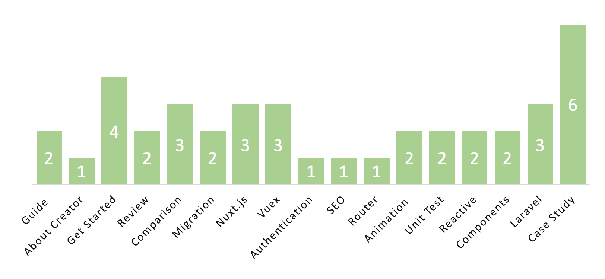

# learn-vue.js
Top 40 Vue.js Articles of 2017

</a>

[English Version](./README.md) | [中文版本](./CN.md)

For Jan-Dec 2017, we compared nearly 10,000 articles about Vue.js and picked the Top 40 (0.4%).

This is an extremely competitive list. Mybridge AI ranks articles based on the quality of content measured by our machine and a variety of human factors including the number of shares and minutes read.

This directory is designed to make your life easier as it organizes the most useful articles by 17 key topics, where experienced web developers share their lessons working with Vue.js

</a>

If you like a version with images: [Go to our Medium link](https://goo.gl/MTnGCn)

 

1. [Guide ](#guide)
1. [About Creator](#about-creator)
1. [Get Started](#get-started)
1. [Review](#review)
1. [Comparison](#comparison)
1. [Migration](#migration)
1. [Nuxt.js](#nuxt.js)
1. [Vuex](#vuex)
1. [Authentication](#authentication)
1. [SEO](#seo)
1. [Router](#router)
1. [Animation ](#animation )
1. [Unit Test](#unit-test)
1. [Reactive](#reactive)
1. [Components](#components)
1. [Laravel](#laravel)
1. [Case Study](#case-study)

 

### Recommended Learning

A) Beginner: [Vue JS 2 Course for Students with ZERO ES6 foundation: Master VueJS, NPM, Webpack, Vue JS CLI, components, Router, and VueX.](http://bit.ly/2GTeexh) [175 recommends, 4.9/5 stars]

B) Nuxt.js: [Nuxt.js — Vue.js on Steroids. Build highly engaging Vue JS apps with Nuxt.js. Nuxt adds easy server-side-rendering and a folder-based config approach.](http://bit.ly/2GU4V01) [500 recommends, 5/5 stars]

 

### Guide 
* [Vue.js Official Style Guide](https://vuejs.org/v2/style-guide/?utm_source=mybridge&utm_medium=email&utm_campaign=read_more)
* [Vue.js 2.3 CheatSheet](https://vuejs-tips.github.io/cheatsheet?utm_source=mybridge&utm_medium=email&utm_campaign=read_more)

 

### About Creator
* [Between the Wires: An interview with Vue.js creator Evan You](https://medium.freecodecamp.com/between-the-wires-an-interview-with-vue-js-creator-evan-you-e383cbf57cc4?utm_source=mybridge&utm_medium=email&utm_campaign=read_more)

 

### Get Started
* [How we do Vue: one year later](https://about.gitlab.com/2017/11/09/gitlab-vue-one-year-later?utm_source=mybridge&utm_medium=email&utm_campaign=read_more)
* [A Vue.js introduction for people who know just enough jQuery to get by](https://medium.freecodecamp.com/vue-js-introduction-for-people-who-know-just-enough-jquery-to-get-by-eab5aa193d77?utm_source=mybridge&utm_medium=email&utm_campaign=read_more)
* [VueJS Introduction by creator Evan You: The Progressive Framework](https://www.youtube.com/watch?v=p2P3z7p_zTI?utm_source=mybridge&utm_medium=email&utm_campaign=read_more)
* [Getting Started with Vue.js - Sabe](https://sabe.io/tutorials/getting-started-with-vue-js?utm_source=mybridge&utm_medium=email&utm_campaign=read_more)

 

### Review
* [State of Vue.js — Key Takeaways from the Report](https://www.monterail.com/blog/state-of-vuejs-report-summary?utm_source=mybridge&utm_medium=email&utm_campaign=read_more)
* [Vue.js review of 2017](https://medium.com/@kevin_peters/what-happened-to-vue-js-in-2017-aeaaa69c2c6f?utm_source=mybridge&utm_medium=email&utm_campaign=read_more)

 

### Comparison
* [Angular vs. React vs. Vue: A 2017 comparison](https://medium.com/unicorn-supplies/angular-vs-react-vs-vue-a-2017-comparison-c5c52d620176?utm_source=mybridge&utm_medium=email&utm_campaign=read_more)
* [Why we moved from Angular 2 to Vue.js (and why we didn’t choose React)](https://medium.com/reverdev/why-we-moved-from-angular-2-to-vue-js-and-why-we-didnt-choose-react-ef807d9f4163?utm_source=mybridge&utm_medium=email&utm_campaign=read_more)
* [Vue.Js Vs. Jquery: Use Cases and Comparison with Examples](https://scotch.io/bar-talk/vuejs-vs-jquery-use-cases-and-comparison-with-examples?utm_source=mybridge&utm_medium=email&utm_campaign=read_more)

 

### Migration
* [Progressively migrating from AngularJS to Vue.js at Unbabel](https://medium.com/unbabel-dev/progressively-migrating-from-angularjs-to-vue-js-at-unbabel-581eb4ae022d?utm_source=mybridge&utm_medium=email&utm_campaign=read_more)
* [Moving From Angular to Vue : A vuetiful journey](https://dev.to/hemantisme/moving-from-angular-to-vue--a-vuetiful-journey?utm_source=mybridge&utm_medium=email&utm_campaign=read_more)

 

### Nuxt.js
* [Nuxt.js: A Universal Vue.js Application Framework — SitePoint](https://www.sitepoint.com/nuxt-js-universal-vue-js?utm_source=mybridge&utm_medium=email&utm_campaign=read_more)
* [Build a Server-Side Rendered Vue App with Nuxt.js](https://scotch.io/tutorials/build-a-server-side-rendered-vue-app-with-nuxtjs#comments-section?utm_source=mybridge&utm_medium=email&utm_campaign=read_more)
* [Building server-rendered apps in Vue using Nuxt.js](https://blog.logrocket.com/building-server-rendered-apps-in-vue-using-nuxt-js-c12c6c253274?utm_source=mybridge&utm_medium=email&utm_campaign=read_more)

 

### Vuex
* [Getting Started with Vuex: Managing State in Vue.js - Sabe](https://sabe.io/tutorials/getting-started-with-vuex?utm_source=mybridge&utm_medium=email&utm_campaign=read_more)
* [Large-scale Vuex application structures](https://medium.com/3yourmind/large-scale-vuex-application-structures-651e44863e2f?utm_source=mybridge&utm_medium=email&utm_campaign=read_more)
* [Exploring Data with Serverless and Vue: Automatically Update GitHub Files With Serverless Functions](https://css-tricks.com/exploring-data-with-serverless-and-vue-part-i?utm_source=mybridge&utm_medium=email&utm_campaign=read_more)

 

### Authentication
* [Vuejs 2 Authentication Tutorial: Learn how to quickly build apps with Vuejs 2 and add authentication the right way.](https://auth0.com/blog/vuejs2-authentication-tutorial?utm_source=mybridge&utm_medium=email&utm_campaign=read_more)

 

### SEO
* [SEO for Vue.js SPA: Prerendering & Server-Side Rendering](https://www.youtube.com/watch?v=HWDcSRHBC9M?utm_source=mybridge&utm_medium=email&utm_campaign=read_more)

 

### Router
* [Getting Started With Vue Router](https://scotch.io/tutorials/getting-started-with-vue-router#comments-section?utm_source=mybridge&utm_medium=email&utm_campaign=read_more)

 

### Animation 
* [Animating VueJS](https://www.youtube.com/watch?v=Vp37fWKOlV4?utm_source=mybridge&utm_medium=email&utm_campaign=read_more)
* [Vue.js Transitions & Animations: Production-Ready Examples - Snipcart](https://snipcart.com/blog/vuejs-transitions-animations?utm_source=mybridge&utm_medium=email&utm_campaign=read_more)

 

### Unit Test
* [Write the first Vue.js Component Unit Test in Jest [Series]](http://alexjoverm.github.io/2017/08/21/Write-the-first-Vue-js-Component-Unit-Test-in-Jest?utm_source=mybridge&utm_medium=email&utm_campaign=read_more)
* [How to Write A Unit Test for Vue.js](https://scotch.io/tutorials/how-to-write-a-unit-test-for-vuejs#comments-section?utm_source=mybridge&utm_medium=email&utm_campaign=read_more)

 

### Reactive
* [Reactivity in Vue.js 2 vs Vue.js 3](https://blog.cloudboost.io/reactivity-in-vue-js-2-vs-vue-js-3-dcdd0728dcdf?utm_source=mybridge&utm_medium=email&utm_campaign=read_more)
* [Reactivity In Vue.js (And Its Pitfalls)](https://medium.com/js-dojo/reactivity-in-vue-js-and-its-pitfalls-de07a29c9407?utm_source=mybridge&utm_medium=email&utm_campaign=read_more)

 

### Components
* [Reusable Vue.js Components Part 1: Introduction](https://designhammer.com/blog/reusable-vuejs-components-part-1-introduction?utm_source=mybridge&utm_medium=email&utm_campaign=read_more)
* [Evan You - Inside Vue Components - Laracon EU 2017](https://www.youtube.com/watch?v=wZN_FtZRYC8?utm_source=mybridge&utm_medium=email&utm_campaign=read_more)

 

### Laravel
* [Vuebnb: A Full-Stack Vue.js and Laravel App](https://vuejsdevelopers.com/2017/11/20/vuebnb-full-stack-laravel?utm_source=mybridge&utm_medium=email&utm_campaign=read_more)
* [Build a Guestbook with Laravel and Vue.js](https://scotch.io/tutorials/build-a-guestbook-with-laravel-and-vuejs?utm_source=mybridge&utm_medium=email&utm_campaign=read_more)
* [Server-Side Rendering With Laravel & Vue.js 2.5](https://vuejsdevelopers.com/2017/11/06/vue-js-laravel-server-side-rendering?utm_source=mybridge&utm_medium=email&utm_campaign=read_more)

 

### Case Study
* [How To Build A Simple Single Page Application Using Vue 2 (Part 1)](https://scotch.io/tutorials/how-to-build-a-simple-single-page-application-using-vue-2-part-1#comments-section?utm_source=mybridge&utm_medium=email&utm_campaign=read_more)
* [An Introduction To Utilizing Public-Key Cryptography In Javascript](https://blog.patricktriest.com/building-an-encrypted-messenger-with-javascript?utm_source=mybridge&utm_medium=email&utm_campaign=read_more)
* [Building a Budget Manager with Vue.js and Node.js (Part I)](https://codeburst.io/building-a-budget-manager-with-vue-js-and-node-js-part-i-f3d7311822a8?utm_source=mybridge&utm_medium=email&utm_campaign=read_more)
* [Launch a Vue.js Blog in Less Than 2 Hours [Live Demo]](https://snipcart.com/blog/vuejs-blog-demo?utm_source=mybridge&utm_medium=email&utm_campaign=read_more)
* [Building a movie app interface with Vue.js](https://hackernoon.com/building-a-movie-app-interface-with-vue-js-cdc8aeb5db0b?utm_source=mybridge&utm_medium=email&utm_campaign=read_more)
* [A progressive Web application with Vue JS, Webpack & Material Design [Part 1]](https://blog.sicara.com/a-progressive-web-application-with-vue-js-webpack-material-design-part-1-c243e2e6e402?utm_source=mybridge&utm_medium=email&utm_campaign=read_more)
